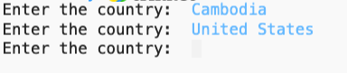
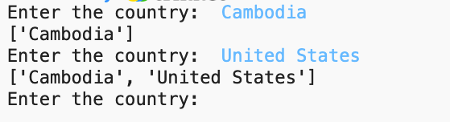

### A programmer wrote the following program:

```
countries = []
 
while True:
    country = input("Enter the country: ")
    countries.append(country)
print(countries)
```

### The program doesn't generate an error, but it doesn't produce the expected output. The produced output is this:



### However, the expected output should be:



### Fiw the code, so it produces the above expected output.