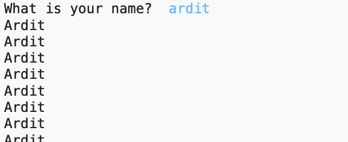

# Coding Exercise: Infinite While-Loop

## Coding Exercise (in your IDE)

***Note**: Please code this exercise in your IDE on your computer to get practice with writing programs in a real environment, such as PyCharm or Visual Studio Code. Once you’ve done your best to solve the exercise, click below to view the solution.*

Create a program that:

(1) prompts the user to **input** their name once, and

(2) **repeatedly** prints out the name with the first letter capitalized.

Here is a screenshot showing how the program behaves when run. The text in blue is the user input.

