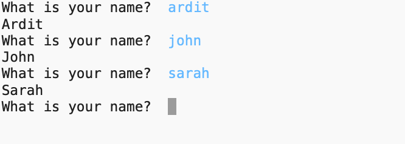

# Coding Exercise: While-Loop and User Input

## Coding Exercise (in your IDE)
*Please code this exercise in your computer IDE.*

Create a program that:

(1) prompts the user to **input** their name,

(2) prints out the name with the first letter capitalized,

(3) keeps prompting the user to input another name

(4)  prints out the name with the first letter capitalized,

(5) The process is repeated infinitely.

The screenshot below shows how the program should behave when run:

