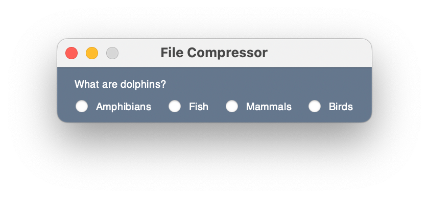
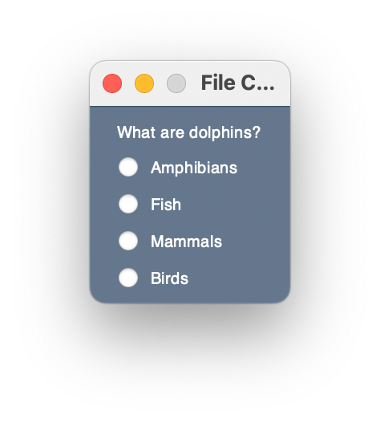

### Bug-Fixing Exercise 1
```
import FreeSimpleGUI as sg
 
label = sg.Text("What are dolphins?")
option1 = sg.Radio("Amphibians", group_id="question1")
option2 = sg.Radio("Fish", group_id="question1")
option3 = sg.Radio("Mammals", group_id="question1")
option4 = sg.Radio("Birds", group_id="question1")
 
window = sg.Window("File Compressor",
                   layout=[[label],
                           [option1, 
                            option2, 
                            option3, 
                            option4],
                           ])
 
window.read()
window.close()
```
The script above generates the output below:



Change the script so that the output below is generated instead:

