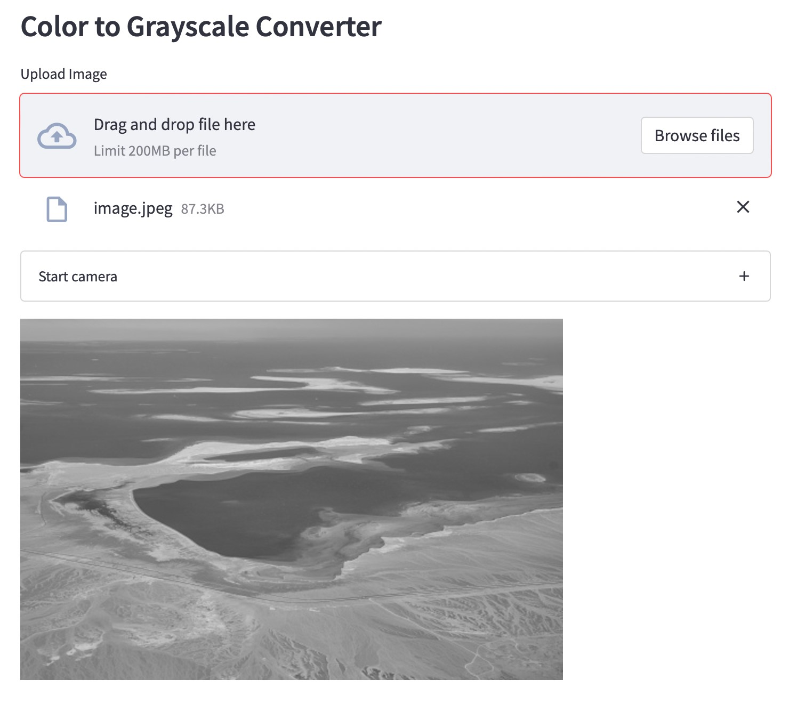

### Coding Exercise 1
Your task for this exercise is to add a new feature to the webcam Streamlit app we built in today's bonus example video. If you don't have the code of the bonus example video, here it is:
```
# Note: This script runs only on a local IDE with "streamlit run main.py"
import streamlit as st
from PIL import Image
 
st.subheader("Color to Grayscale Converter")
 
with st.expander("Start camera"):
    camera_image = st.camera_input("Camera")
 
if camera_image:
    img = Image.open(camera_image)
    gray_camera_img = img.convert('L')
    st.image(gray_camera_img)
```
You need to add a feature to that program that allows users to upload an image from their computer files. Then, the app converts the uploaded image to grayscale and displays it.

**Hint**: You can use <span style="color: orange;">uploaded_image = st.file_uploader("Upload Image")</span> to create a "Browse File" component.

The end product should be as shown in the screenshot down below.

